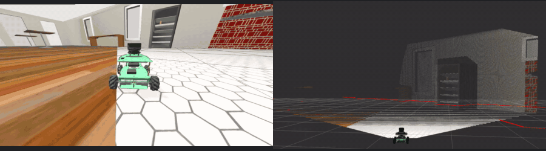

# yahboom_rosmaster

> Meet **Donatello** — the little mecanum robot living in this simulated world.

<p align="center">
  
  <br>
  <a href="docs/media/donatello-gazebo-cafe.webm">Gazebo recording</a>
  ·
  <a href="docs/media/donatello-rviz-sensors.webm">RViz recording</a>
</p>


This repository provides a Yahboom ROSMASTER X3 mecanum robot simulation for
ROS 2 Humble and Gazebo Fortress. The supported standalone workflow includes
contact-driven holonomic motion, wheel-state odometry, TF, 2D LiDAR, IMU data,
and a depth point cloud, along with RGB and depth camera images and camera
calibration messages. It also exposes timestamped simulation ground truth
separately from robot-facing odometry.

Gazebo Fortress is the reference simulator backend. A reduced Gazebo Classic
compatibility backend is available on Apple Silicon and documented below.

Ubuntu 22.04 is the fully supported platform. Apple Silicon Macs run the
simulation natively through RoboStack — see [macOS (Apple Silicon)](#macos-apple-silicon)
for its rendering limits and Classic compatibility backend.

## Requirements

- Ubuntu 22.04
- [ROS 2 Humble](https://docs.ros.org/en/humble/Installation/Ubuntu-Install-Debs.html)
- Gazebo Fortress 6
- `git`, `colcon`, and `rosdep`

ROS 2 Humble and Gazebo Fortress are the supported ROS/Gazebo pairing. After
installing ROS 2 Humble, install the common workspace tools and ROS-Gazebo
integration packages:

```bash
sudo apt update
sudo apt install -y \
  git \
  python3-colcon-common-extensions \
  python3-rosdep \
  ros-humble-ros-gz
```

The build instructions below use `rosdep` to install the remaining dependencies
declared by the repository packages.

## Build

Create a workspace and clone the repository:

```bash
mkdir -p ~/rosmaster_ws/src
cd ~/rosmaster_ws/src
git clone https://github.com/AIRclub-UdeSA/yahboom_rosmaster.git
```

Initialize `rosdep` once on a new machine:

```bash
sudo rosdep init
```

If `rosdep` is already initialized, skip that command. Then install dependencies
and build from the workspace root:

```bash
cd ~/rosmaster_ws
source /opt/ros/humble/setup.bash

rosdep update
rosdep install --from-paths src --ignore-src -r -y --rosdistro humble

colcon build --symlink-install
source install/setup.bash
```

Source both ROS 2 and the workspace overlay in every new terminal used with the
simulator:

```bash
source /opt/ros/humble/setup.bash
source ~/rosmaster_ws/install/setup.bash
```

## Docker (Containerized Linux Simulation)

For an isolated Linux environment, install Docker Engine first. GUI forwarding
uses X11; install `xauth` on the host, and install the NVIDIA Container Toolkit
when using an NVIDIA GPU.

```bash
cd dockerfiles

./container.sh start         # build the image and start the container
./container.sh build         # install dependencies and compile the workspace
./container.sh sim           # launch Gazebo + RViz
./container.sh teleop        # drive the robot from another terminal
./container.sh stop          # stop the container
```

Use `./container.sh sim-headless` when no GUI is needed. Run
`./container.sh doctor` to inspect the container, GPU, and X11 connection.

## macOS (Apple Silicon)

macOS has no ROS 2 Humble debs, so the environment comes from
[RoboStack](https://robostack.github.io/) conda packages managed by
[pixi](https://pixi.sh). `pixi.toml` pins ROS 2 Humble, Gazebo Fortress 6 and
the build toolchain; `pixi.lock` makes every machine resolve identically.

```bash
brew install pixi

git clone https://github.com/AIRclub-UdeSA/yahboom_rosmaster.git
cd yahboom_rosmaster

pixi install        # solve and download the ROS 2 + Gazebo environment
pixi run build      # colcon build the simulator packages
pixi run sim        # launch the simulation and RViz
```

`pixi run <task>` runs inside the environment, so no `source` step is needed.
For an interactive shell with ROS 2 on the path, use `pixi shell`. Other tasks:
`pixi run sim-headless` (no RViz), `pixi run stop` (tear down every simulation
process), and `pixi run clean`.

Verified on an M4 Max: the robot spawns and drives, mecanum strafing works, and
`/clock`, `/joint_states`, `/odom`, `/imu/data`, `/tf` and `/cmd_vel` all behave
as they do on Ubuntu.

### Gazebo Classic backend — GUI and LiDAR on macOS

The Fortress backend above cannot open a Gazebo window or produce a LiDAR scan on
macOS (see the next section for why). A second backend runs the robot on
**Gazebo Classic**, which provides both the Gazebo GUI and CPU-raycast LiDAR.

It lives in its own folder with a single entry point and its own guide:

```bash
cd yahboom_robostack_M_silycon
./run setup && ./run build && ./run sim
```

See [`yahboom_robostack_M_silycon/README.md`](yahboom_robostack_M_silycon/README.md)
for the full walkthrough, including setup and teleoperation. The same simulation
is available from the repository root as `pixi run sim-classic`.

| | Fortress (`pixi run sim`) | Classic (`./run sim`) |
| --- | --- | --- |
| Gazebo GUI | unavailable | **works** |
| Driving, mecanum strafe | works | works |
| LiDAR `/scan` | unavailable | **works** (CPU raycast) |
| Wheels spin visually | yes | no — welded |
| Obstacles block the robot | yes | no |
| RGB-D camera | unavailable | unavailable |

`gazebo_ros_planar_move` imposes a body velocity rather than torquing the wheels,
which is why the wheels do not turn and collisions do not stop the base. Both are
limitations of the Classic backend; the Fortress backend on Linux remains the
physically faithful one.

The two backends are separate pixi environments because
`ros-humble-gazebo-ros-pkgs` and `ros-humble-ros-gz` cannot be solved together,
and they use separate build trees so neither overwrites the other.

### What does not work on macOS

Two things are unavailable, both from the same upstream limitation. Gazebo
initialises its ogre2 renderer on a secondary thread, and macOS only permits
window creation on the main thread, so the render context cannot be created:

| Feature | Status |
| --- | --- |
| LiDAR `/scan`, RGB-D `/cam_1/*` | Unavailable — would crash the server, so the launch omits both sensors |
| Gazebo GUI | Unavailable — `ign gazebo -g` refuses to start on macOS |
| Everything else | Works natively |

The fix for this exists only in Gazebo Garden and newer
([gz-sim#960](https://github.com/gazebosim/gz-sim/issues/960),
[gz-sim#1225](https://github.com/gazebosim/gz-sim/pull/1225)) and was never
backported to Fortress. It cannot be worked around from this repository:
`libignition-rendering6` requires `ogre-next 2.2.x`, and no conda-forge build of
that series ships the Metal render system. Gazebo's own macOS CI has had these
sensors failing since 2022
([gz-rendering#654](https://github.com/gazebosim/gz-rendering/issues/654)).

Newer Gazebo does carry the fix, so moving off Fortress is the only real
alternative. That was tried and did not pan out: in a scratch RoboStack Jazzy
environment, Gazebo Harmonic 8.10 does ship `RenderSystem_Metal` and starts
without the macOS window error, but `gz sim -s` then hung during world load —
with no sensors at all, and with `--iterations` set — so no sensor data was ever
produced. Whether that hang is fixable was not investigated further; it would
also mean leaving Humble, which the rest of this repository targets.

Consequences for this backend: **RViz replaces the Gazebo GUI**, and `/scan` is
unavailable. The Gazebo Classic backend above supplies a GUI and LiDAR when
those simulator outputs are needed. The RGB-D camera remains unavailable on
macOS with either backend.

The launch sets these defaults automatically; to override on a Linux machine
nothing changes, and both flags can be forced explicitly:

```bash
ros2 launch yahboom_rosmaster_gazebo rosmaster_gazebo_fortress.launch.py \
  render_sensors:=true use_ros2_control:=true
```

### macOS-specific settings

`scripts/pixi_activate.sh` exports four settings on activation. Each fixes a
failure that otherwise looks like a hang or a network fault:

- `ROS_LOCALHOST_ONLY=1` — a Mac exposes ~20 multicast interfaces (`en0`,
  `awdl0`, `bridge0`, `utun0-5`). DDS participants pick different ones and never
  discover each other, leaving each node with a partial ROS graph. Set it to `0`
  after activation to reach a physical robot over the network.
- `IGN_IP` / `GZ_IP=127.0.0.1` — the same problem in Gazebo's own transport;
  without it `ign service -l` returns nothing.
- `RMW_IMPLEMENTATION=rmw_cyclonedds_cpp` — the more reliable middleware here.
- `IGN_GAZEBO_SYSTEM_PLUGIN_PATH` — Gazebo seeds its plugin search from
  `LD_LIBRARY_PATH`, which conda never sets and macOS does not use.

Two further macOS behaviours are handled inside the launch file: `ros2_control`
is bypassed in favour of Gazebo's own `JointStatePublisher` (activating a
controller aborts the server, because `ros2_control` waits on a condition
variable holding an unlocked mutex and libc++ rejects that), and RViz's Camera
display is stripped from the config (it builds a second render panel and aborts
RViz).

If a run ends badly, `pixi run stop` clears every leftover process. This matters
more than it sounds: a stale `robot_state_publisher` creates a duplicate node
name that breaks discovery for the next run.

## Quick Start

### Launch the Simulator

Start the default empty world with the Gazebo GUI and RViz:

```bash
cd ~/rosmaster_ws
source /opt/ros/humble/setup.bash
source install/setup.bash

ros2 launch yahboom_rosmaster_bringup rosmaster_x3_sim.launch.py
```

Startup is staged while Gazebo creates the robot and starts its ROS interfaces.
Wait for these messages before checking odometry:

```text
Configured and activated joint_state_broadcaster
Publishing wheel-state odometry from /joint_states to /odom
```

The default `stress` motion profile adds deterministic, uncalibrated wheel slip,
roller resistance, and per-wheel asymmetry. To recover the previous zero-slip
baseline, launch with `motion_profile:=ideal`.

### Launch Without GUIs

Run the Gazebo server without the Gazebo GUI or RViz:

```bash
ros2 launch yahboom_rosmaster_bringup rosmaster_x3_sim.launch.py \
  gui:=false \
  rviz:=false \
  headless:=true
```

### Launch the Cafe World

The repository supports the empty and cafe Fortress worlds. Launch the cafe
world with:

```bash
ros2 launch yahboom_rosmaster_bringup rosmaster_x3_sim.launch.py \
  world:=cafe.world
```

### Maze Worlds

The repository also ships eight maze worlds for practice and competition
runs -- four authored for this project and four imported from
[plywood_mazes](https://github.com/rfzeg/plywood_mazes). They launch the
same way as the cafe world; a bare file name resolves inside `worlds/`:

```bash
ros2 launch yahboom_rosmaster_bringup rosmaster_x3_sim.launch.py \
  world:=laberinto_simple.world
```

| World | Description | Automated coverage |
|-------|-------------|---------------------|
| `laberinto_simple.world` | Small 6x6 m maze with three internal partition walls -- ships a matching occupancy map at `maps/laberinto_simple.yaml` | `world_smoke_laberinto_simple` |
| `laberinto_simple_victimas.world` | `laberinto_simple.world` layout plus three color-marker obstacle cubes (two red, one blue; 0.25x0.25x0.3 m, with collision) for camera/LiDAR color-detection workshops | `world_smoke_laberinto_simple_victimas` |
| `laberinto_1.world` | Larger, more convoluted maze exported from Gazebo's Building Editor | `world_smoke_laberinto_1` |
| `laberinto_1_victimas.world` | `laberinto_1.world` layout plus four color-marker obstacle cubes (three red, one blue; 0.25x0.25x0.3 m, one shrunk to 0.15x0.15x0.3 m to fit a ~0.31 m gap between two walls) tucked into narrow passages -- diagonal column corridor, small side room, stub-wall zigzag, and a wall gap -- so the robot has to enter a corridor before it can see and identify the color | `world_smoke_laberinto_1_victimas` |
| `maze_1_6x5.world` | plywood_mazes maze 1, 6x5 m | `world_smoke_maze_1` |
| `maze_1_6x5_victimas.world` | `maze_1_6x5.world` layout plus four color-marker obstacle cubes (two red, two blue; 0.25x0.25x0.3 m) tucked into narrow passages for camera/LiDAR color-detection workshops | `world_smoke_maze_1_victimas` |
| `maze_2_6x5.world` | plywood_mazes maze 2, 6x5 m | `world_smoke_maze_2` |
| `maze_2_6x5_victimas.world` | `maze_2_6x5.world` layout plus five color-marker obstacle cubes (three red, two blue; 0.25x0.25x0.3 m) tucked into narrow passages for camera/LiDAR color-detection workshops | `world_smoke_maze_2_victimas` |
| `maze_3_6x6.world` | plywood_mazes maze 3, 6x6 m | `world_smoke_maze_3` |
| `maze_4_metal_6x6.world` | plywood_mazes maze 4, metal panels, 6x6 m | `world_smoke_maze_4` |

Walls are 0.5 m tall in all eight -- clear of the LiDAR (0.11 m) and camera
(0.05 m) mount heights, but low enough to inspect the layout from the
Gazebo GUI.

Every maze world above has a `world_smoke_*` launch test (see
`test/world_smoke.launch.py`): headless spawn, no initial collision (the
robot stays level, drifts less than 5 cm during a 3s no-command window, and
stays within 10 cm of its expected (0, 0) spawn point), a short forward
`/cmd_vel` command that must produce real ground-truth displacement (catching
a robot whose wheels spin without translating), and the core topics (`/odom`,
`/tf`, `/joint_states`, `/scan`, `/imu/data`) coming up. This is intentionally
lighter than the `sensor_contract_*` tests on the empty and cafe worlds,
which additionally assert message rates, latency, and payload shape -- maze
layouts share the same robot and sensor stack, so only spawn validity and
basic movement actually vary world to world. `_victimas` worlds get the
same smoke test as their base layout, since the color-marker cubes are the
only new geometry to check for; any future `_victimas` world should be
added the same way rather than getting the full contract.

`simple_room.world` and `willowgarage.world` are deliberately excluded from
this coverage -- see "Current Project Status" below, they are legacy
migration assets, not supported practice worlds.

### Simulator Launch Arguments

| Argument | Default | Description |
|----------|---------|-------------|
| `world` | `empty.world` | Bundled world filename or an absolute world path |
| `gui` | `true` | Start the Gazebo GUI client |
| `rviz` | `true` | Start RViz |
| `headless` | `false` | Run the Gazebo server without its GUI client |
| `use_sim_time` | `true` | Use the Gazebo simulation clock; keep enabled for the supported workflow |
| `motion_profile` | `stress` | Wheel contact model: uncalibrated `stress` or zero-slip `ideal` |
| `motion_bias` | `false` | Add randomized command drift when enabled |

## Controlling the Robot

The public velocity-command topic is `/cmd_vel`. Positive `linear.x` moves the
robot forward, positive `linear.y` strafes left, and positive `angular.z`
rotates counterclockwise.

### Keyboard Teleoperation

Install the keyboard teleoperation package if needed:

```bash
sudo apt install -y ros-humble-teleop-twist-keyboard
```

In a second sourced terminal, run:

```bash
ros2 run teleop_twist_keyboard teleop_twist_keyboard
```

Follow the program's holonomic movement bindings to drive and strafe the robot.

### Direct Motion Commands

The following finite commands are useful for checking each mecanum axis. Run
them one at a time with enough free space around the robot.

Move forward for approximately two seconds:

```bash
ros2 topic pub --rate 10 --times 20 /cmd_vel geometry_msgs/msg/Twist \
  '{linear: {x: 0.20, y: 0.0, z: 0.0}, angular: {x: 0.0, y: 0.0, z: 0.0}}'
```

Strafe left for approximately two seconds:

```bash
ros2 topic pub --rate 10 --times 20 /cmd_vel geometry_msgs/msg/Twist \
  '{linear: {x: 0.0, y: 0.20, z: 0.0}, angular: {x: 0.0, y: 0.0, z: 0.0}}'
```

Rotate counterclockwise for approximately two seconds:

```bash
ros2 topic pub --rate 10 --times 20 /cmd_vel geometry_msgs/msg/Twist \
  '{linear: {x: 0.0, y: 0.0, z: 0.0}, angular: {x: 0.0, y: 0.0, z: 0.50}}'
```

## Simulator Architecture

### Command Flow

```text
/cmd_vel
  -> cmd_vel_watchdog.py
  -> /cmd_vel_gz
  -> ros_gz_bridge
  -> /model/rosmaster_x3/cmd_vel
  -> Gazebo MecanumDrive
  -> wheel joint velocity targets
  -> DART wheel/ground contact
```

Gazebo's native `MecanumDrive` system calculates the four wheel targets.
`gz_ros2_control` is kept read-only for wheel and IMU state, and only
`joint_state_broadcaster` is loaded.

The watchdog republishes the latest command to the internal `/cmd_vel_gz` topic
and publishes zero when `/cmd_vel` has been silent for 0.5 seconds.

Wheel contact parameters come from
`yahboom_rosmaster_gazebo/config/motion_profiles.yaml`. The default `stress`
profile is deterministic and deliberately imperfect; it has not been fitted to
a physical ROSMASTER X3. See
`yahboom_rosmaster_gazebo/doc/motion_profiles.md` for values and measurements.

### Odometry and TF

- `/joint_states` is published by `joint_state_broadcaster`.
- `/odom` is integrated from wheel joint positions by
  `wheel_state_odometry.py`.
- `odom -> base_footprint` is published by `wheel_state_odometry.py`.
- `/ground_truth/odom` is the timestamped Gazebo world pose of the simulated
  chassis. It is measurement-only and does not publish a TF edge.
- Robot link transforms are published by `robot_state_publisher`.

## Working ROS Interfaces

| Topic | Type | Frame / nominal rate | Purpose |
|-------|------|----------------------|---------|
| `/clock` | `rosgraph_msgs/msg/Clock` | — | Gazebo simulation clock |
| `/cmd_vel` | `geometry_msgs/msg/Twist` | — | Public velocity-command input |
| `/cmd_vel_gz` | `geometry_msgs/msg/Twist` | — | Internal watchdog output bridged to Gazebo |
| `/joint_states` | `sensor_msgs/msg/JointState` | `base_link` / 30 Hz | Wheel joint positions and velocities |
| `/odom` | `nav_msgs/msg/Odometry` | `odom` -> `base_footprint` / 30 Hz | Wheel-state odometry |
| `/ground_truth/odom` | `nav_msgs/msg/Odometry` | `world` -> `base_footprint` / 50 Hz | Measurement-only Gazebo ground truth; not TF |
| `/tf` | `tf2_msgs/msg/TFMessage` | — | Dynamic transforms |
| `/tf_static` | `tf2_msgs/msg/TFMessage` | — | Static robot transforms |
| `/scan` | `sensor_msgs/msg/LaserScan` | `laser_link` / 5 Hz | 1080-sample 2D LiDAR scan |
| `/imu/data` | `sensor_msgs/msg/Imu` | `imu_link` / 10 Hz | Simulated IMU data |
| `/cam_1/color/image_raw` | `sensor_msgs/msg/Image` | `cam_1_depth_optical_frame` / 5 Hz | 424x240 `rgb8` image |
| `/cam_1/depth/image_raw` | `sensor_msgs/msg/Image` | `cam_1_depth_optical_frame` / 5 Hz | 424x240 `32FC1` depth in metres |
| `/cam_1/color/camera_info` | `sensor_msgs/msg/CameraInfo` | `cam_1_depth_optical_frame` / 5 Hz | RGB camera intrinsics |
| `/cam_1/depth/camera_info` | `sensor_msgs/msg/CameraInfo` | `cam_1_depth_optical_frame` / 5 Hz | Depth camera intrinsics |
| `/cam_1/depth/color/points` | `sensor_msgs/msg/PointCloud2` | `cam_1_depth_frame` / 5 Hz | Organized XYZRGB point cloud, bridged lazily |

The images and camera information use the ROS optical convention (+Z forward,
+X right, +Y down). Gazebo's native point cloud is correctly labelled in the
camera's regular sensor frame (+X forward, +Y left, +Z up); TF provides the
fixed transform between the two frames. Fortress stamps its native cloud with
the optical frame id, so the bridge publishes it to the private handoff topic
`/internal/cam_1/points_raw` and `pointcloud_frame_relay.py` relabels the
header to the true frame before publishing `/cam_1/depth/color/points`.
Topics under `/internal/` are implementation details: subscribe to the public
contract topics instead.

The current camera is an idealized, pre-registered, single-aperture RGB-D
model. Fortress renders the combined color and depth streams from one pose, so
all four image and camera-information topics use
`cam_1_depth_optical_frame`. The compatibility aliases `cam_1_color_frame` and
`cam_1_color_optical_frame` remain available in TF but are co-located with the
corresponding depth frames. This nominal model does not claim the independently
calibrated color/depth extrinsics of the physical camera represented by the
visual mesh.

## Verify the Simulator

Run these checks in a second sourced terminal after simulator startup.

### Controller and Topics

```bash
ros2 control list_controllers

ros2 topic list | sort | grep -E \
  '^/(clock|cmd_vel|cmd_vel_gz|joint_states|odom|ground_truth/odom|scan|imu/data|tf|tf_static|cam_1/)'
```

The controller list should contain:

```text
joint_state_broadcaster ... active
```

The removed custom controller topic should not exist:

```bash
ros2 topic list | grep '^/mecanum_drive_controller/cmd_vel$' \
  && echo "BAD: removed controller topic exists" \
  || echo "OK: removed controller topic is absent"
```

### Odometry and TF

```bash
ros2 topic echo /joint_states --once
ros2 topic echo /odom --once
ros2 topic echo /ground_truth/odom --once
timeout --signal=INT 5 ros2 run tf2_ros tf2_echo odom base_footprint
```

### Sensors

Each command should report incoming messages:

```bash
timeout --signal=INT 5 ros2 topic hz /scan
timeout --signal=INT 5 ros2 topic hz /imu/data
timeout --signal=INT 5 ros2 topic hz /cam_1/color/image_raw
timeout --signal=INT 5 ros2 topic hz /cam_1/depth/image_raw
timeout --signal=INT 5 ros2 topic hz /cam_1/depth/color/points
ros2 topic echo /cam_1/color/camera_info --once
ros2 topic echo /cam_1/depth/camera_info --once
```

The repository registers a headless contract for both supported worlds plus
known-geometry and commanded-motion gates. Together they validate ten-message
delivery, nominal rates, first-message latency, timestamped TF, RGB-D geometry,
registered color/depth frame origins, LiDAR geometry and handedness, IMU axes,
mecanum wheel signs, odometry/TF agreement, and odometry
rewind/discontinuity handling. They also verify the ground-truth topic and the
ideal-versus-stress motion-profile contract:

```bash
colcon test --packages-select yahboom_rosmaster_gazebo \
  --ctest-args -R '^(sensor_contract_.*|depth_geometry|ground_truth_contract|motion_profile_.*|lidar_geometry|imu_motion|base_feedback|wheel_odometry_resilience)$' \
  --output-on-failure
colcon test-result --verbose
```

The eight maze/practice worlds are covered separately by the lighter
`world_smoke_*` tests (spawn validity, initial collisions, a forward-motion
check, core topics -- see "Maze Worlds" above), so they are not part of the
regex above:

```bash
colcon test --packages-select yahboom_rosmaster_gazebo \
  --ctest-args -R '^world_smoke_.*$' \
  --output-on-failure
colcon test-result --verbose
```

### Command Watchdog

Publish one nonzero input, wait longer than the 0.5-second timeout, and inspect
the internal command:

```bash
ros2 topic pub --once /cmd_vel geometry_msgs/msg/Twist \
  '{linear: {x: 0.10, y: 0.0, z: 0.0}, angular: {x: 0.0, y: 0.0, z: 0.0}}'

sleep 1
ros2 topic echo /cmd_vel_gz --once
```

The reported twist should be zero. The robot's physical stopping time is also
affected by the acceleration limit in the Gazebo drive plugin.

## Development Checks

Run the repository checks from the workspace root:

```bash
cd ~/rosmaster_ws
source /opt/ros/humble/setup.bash
source install/setup.bash

git -C src/yahboom_rosmaster diff --check

python3 -m py_compile $(find src/yahboom_rosmaster -name '*.py' \
  -not -path '*/build/*' \
  -not -path '*/install/*' \
  -not -path '*/log/*')

xacro src/yahboom_rosmaster/yahboom_rosmaster_description/urdf/robots/rosmaster_x3.urdf.xacro \
  use_gazebo:=true > /tmp/rosmaster_x3.urdf
check_urdf /tmp/rosmaster_x3.urdf

colcon build --symlink-install
colcon test
colcon test-result --verbose --all
rosdep check --from-paths src --ignore-src --rosdistro humble
```

## Troubleshooting

### Package or Launch File Not Found

Source both the ROS installation and the workspace overlay in the current
terminal:

```bash
source /opt/ros/humble/setup.bash
source ~/rosmaster_ws/install/setup.bash
```

Confirm that ROS resolves the simulator package from the expected workspace:

```bash
ros2 pkg prefix yahboom_rosmaster_gazebo
```

### Controller or Odometry Not Ready

Robot creation and controller startup are staged. Wait for the controller
activation message, then check:

```bash
ros2 control list_controllers
ros2 topic echo /joint_states --once
ros2 topic echo /odom --once
```

Also confirm that Gazebo is running and the simulation is not paused.

### Stale Workspace Overlay

If a deleted package such as `mecanum_drive_controller` still resolves, or a new
package cannot be found, rebuild a clean workspace overlay:

```bash
cd ~/rosmaster_ws
source /opt/ros/humble/setup.bash
rm -rf build install log
colcon build --symlink-install
source install/setup.bash
```

The removed controller package should not resolve from the rebuilt workspace:

```bash
ros2 pkg prefix mecanum_drive_controller
```

### Run Without the Gazebo GUI

If the Gazebo GUI cannot start in the current display environment, use the
server-only command:

```bash
ros2 launch yahboom_rosmaster_bringup rosmaster_x3_sim.launch.py \
  gui:=false \
  rviz:=false \
  headless:=true
```

## Current Project Status

The supported user path is the standalone, single-robot Fortress simulator in
the empty or cafe world. Its forward, lateral, and rotational motion,
wheel odometry, TF, LiDAR, IMU, RGB and depth images, camera information, and
depth point cloud have been exercised on ROS 2 Humble. The default uncalibrated
stress profile creates measurable wheel-odometry divergence while the optional
ideal profile preserves the previous near-zero-error baseline. Automated headless
contracts cover both supported worlds, and isolated acceptance tests exercise
controlled RGB-D/LiDAR geometry, IMU motion, wheel signs, odometry, ground
truth, profile selection, and TF. The eight maze/practice worlds each get a
lighter `world_smoke_*` launch test covering spawn validity, initial
collisions, a forward-motion check, and core topic liveness -- see "Maze
Worlds" above.

The following simulator limitations remain:

- The default drivetrain stress profile is deterministic but uncalibrated. It
  must not be described as reproducing the physical ROSMASTER X3 until its
  contact values are fitted against synchronized wheel odometry and external
  ground truth. Motor, encoder, floor, latency, and battery effects remain
  separate future calibration layers.
- Sensor data is nominal simulation output. The camera, LiDAR, and IMU models
  have not been calibrated against measurements from the physical robot. The
  combined RGB-D model is deliberately pre-registered at one color/depth
  origin; a measured physical baseline requires independently rendered sensors
  and is deferred until real camera calibration is available.
- The Fortress bridge leaves LiDAR `scan_time` unspecified at zero. The GPU
  LiDAR is an instantaneous snapshot model, so `time_increment=0` is
  intentional. Tests verify the 0.2-second period from consecutive simulation
  timestamps; rolling acquisition is deferred until the installed LiDAR is
  identified.
- IMU covariance arrays are all zero, which ROS defines as covariance unknown;
  the configured nominal noise is not yet communicated to consumers as a
  measured covariance.
- `simple_room.world` and `willowgarage.world` are retained migration assets;
  they are deliberately not supported Fortress worlds and are excluded from
  automated coverage, unlike the eight maze worlds below.
- The eight maze worlds (`laberinto_simple.world`, `laberinto_simple_victimas.world`,
  `laberinto_1.world`, `laberinto_1_victimas.world`, `maze_1_6x5.world`,
  `maze_2_6x5.world`, `maze_3_6x6.world`, `maze_4_metal_6x6.world`) each have
  a `world_smoke_*` launch test (spawn validity, no initial collision, a
  forward-motion check, core topics) but not the full rate/message-shape
  contract that the empty and cafe worlds get -- see the "Maze Worlds"
  section above. Only `laberinto_simple.world` ships a matching occupancy
  map (`maps/laberinto_simple.yaml`); the others have no pre-built map.
  `maze_3_6x6.world`'s map was removed -- it no longer matched the world
  after the maze offset changed in #10, and needs to be re-captured (see
  #15). The obstacle cubes in `laberinto_simple_victimas.world` and
  `laberinto_1_victimas.world` have collision but are not part of any map
  either -- they are meant to be detected live via camera/LiDAR, not
  pre-mapped.
- Multi-robot operation and real-hardware bringup are not provided.

The 0.5-second watchdog publishes zero on normal command loss and orderly
shutdown. It is not a safety-rated controller: abrupt watchdog failure or loss
of its bridge can leave Gazebo retaining the last drive target until another
command is received or the simulation is stopped.

## Repository Layout

| Package / Directory | Contents |
|---------------------|----------|
| `yahboom_rosmaster` | Repository metapackage |
| `yahboom_rosmaster_bringup` | Canonical simulator launch entrypoints and helpers |
| `yahboom_rosmaster_description` | Xacro/URDF, kinematic parameters, visual/collision meshes, and RViz configs |
| `yahboom_rosmaster_gazebo` | Fortress worlds, bridge configs, simulator launch, watchdog, odometry, and test probes |
| `yahboom_rosmaster_msgs` | Custom interface definitions |
| `yahboom_robostack_M_silycon` | macOS Apple Silicon pixi + Gazebo Classic simulation environment |
| `dockerfiles` | Docker container setup (`Dockerfile`, `container.sh`) for isolated Linux simulation |

## Contributing

See [CONTRIBUTING.md](CONTRIBUTING.md) for the dev setup, good first issues,
coding style, and the pull request process.

## Provenance

This repository is a ROS 2 Humble and Gazebo Fortress fork of
[Automatic Addison's `yahboom_rosmaster`](https://github.com/automaticaddison/yahboom_rosmaster)
repository. The current fork is maintained at
[`AIRclub-UdeSA/yahboom_rosmaster`](https://github.com/AIRclub-UdeSA/yahboom_rosmaster).

## License

The packages are distributed under the BSD-3-Clause license. Each package
contains its own `LICENSE` file.
